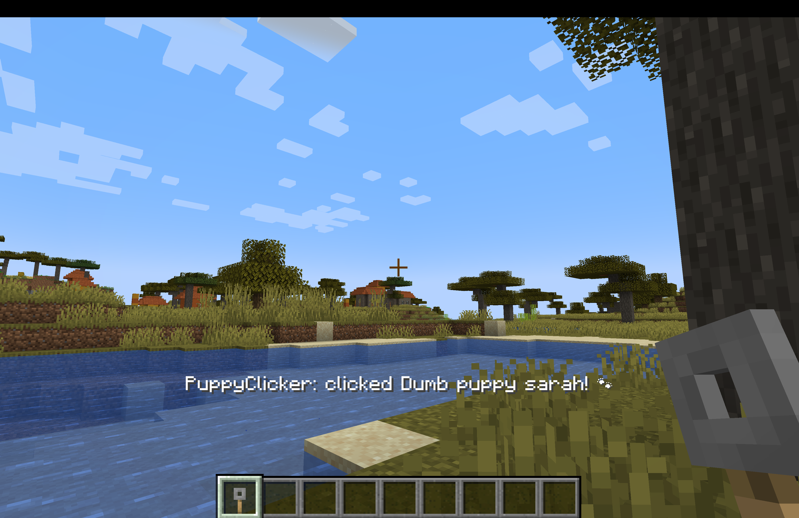
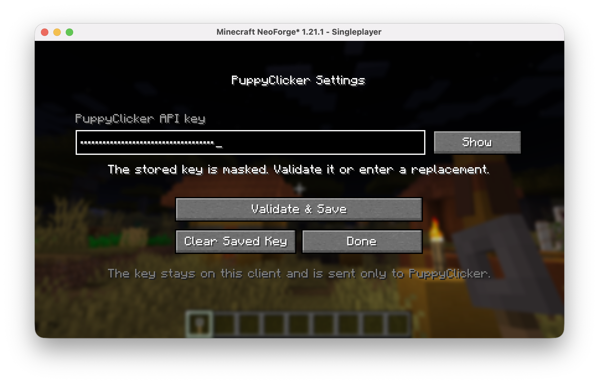
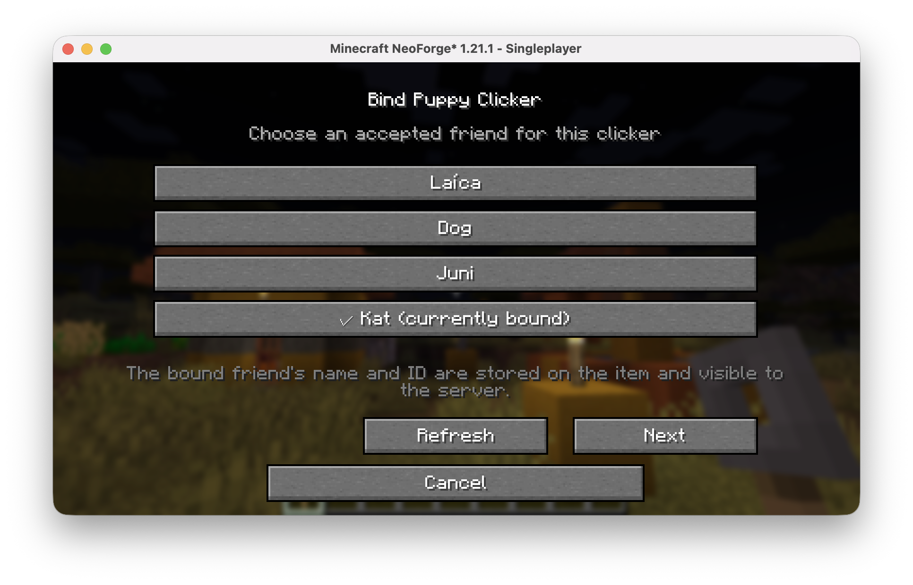
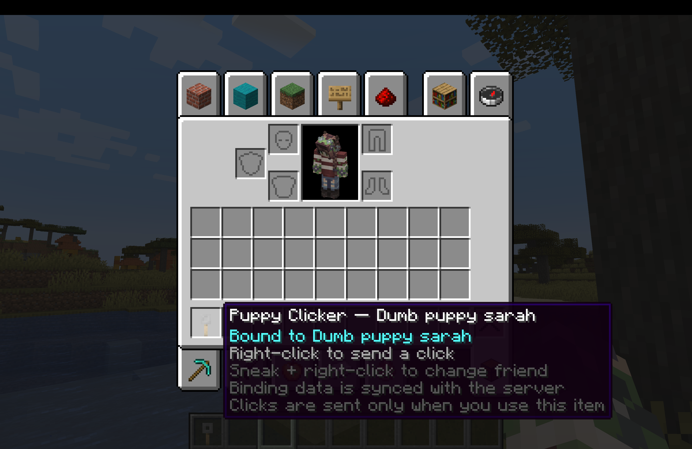
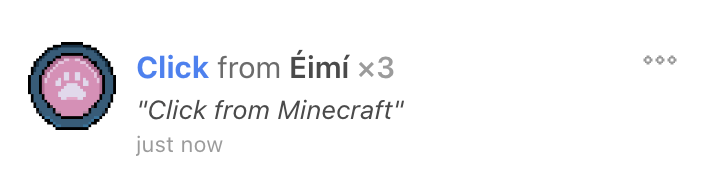
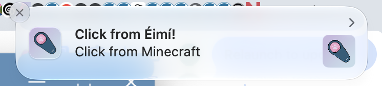

# PuppyClicker for Minecraft

PuppyClicker for Minecraft is a NeoForge mod that connects Minecraft 1.21.1
to a [PuppyClicker](https://puppyclicker.app/) account. Send a self-click with
a configurable keybind, or craft clicker items and bind each one to a different
accepted PuppyClicker friend or "pet". This makes it possible to carry several
individually named clickers and choose who receives each click directly from
the hotbar.

Every outgoing action requires deliberate player input.

## At a glance

### Configure and bind

| Masked API-key configuration | Accepted-friend picker |
| --- | --- |
|  |  |

### Send and confirm

| Bound clicker details | PuppyClicker activity confirmation |
| --- | --- |
|  |  |

PuppyClicker can also display its own notification after receiving the outgoing
Minecraft click:

## Features

- Send a self-click using a configurable keybind, set to `P` by default.
- Configure and validate a PuppyClicker API key through
  **Mods → PuppyClicker for Minecraft → Config**.
- Retrieve the account's accepted PuppyClicker friends.
- Craft multiple Puppy Clicker items and bind each stack to a different friend.
- Send clicks without blocking Minecraft's render thread.
- Display concise success, rate-limit, credential, HTTP, and network feedback
  above the hotbar.
- Prevent overlapping requests, apply a one-second local cooldown, and honour
  the API's `Retry-After` response after a `429`.

## Requirements

- Minecraft 1.21.1
- NeoForge 21.1.243 or newer
- Java 21
- A PuppyClicker account and personal API key beginning with `pak_`
- The mod installed on both the Minecraft client and server

The server installation is required for the custom clicker item and its
synchronised per-stack binding data. The Minecraft server does not receive the
PuppyClicker API key and does not connect to the PuppyClicker API.

## Setup and use

1. Place the mod JAR in the `mods` directory for both the client and server.
2. Start Minecraft, open **Mods**, select **PuppyClicker for Minecraft**, and
   choose **Config**.
3. Enter the API key in the masked field and choose **Validate & Save**. The mod
   verifies the key through `GET /api/v2/me` before saving it.
4. Press `P` to send a self-click. Change this binding under
   **Options → Controls → Key Binds → PuppyClicker** if needed.
5. Craft a Puppy Clicker with a stone button, an iron nugget, and redstone in
   any arrangement.

| Clicker interaction | Result |
| --- | --- |
| Right-click an unbound clicker | Open the accepted-friend picker |
| Right-click a bound clicker | Send a click to its selected friend |
| Sneak and right-click a bound clicker | Choose a different friend |

The configuration is stored in the Minecraft instance's
`config/puppyclicker-client.toml`. For the Gradle development client, that file
is `run/config/puppyclicker-client.toml`.

## Privacy and informed consent

The mod makes HTTPS requests to `puppyclicker-api.boundfire.com` to validate
the API key, retrieve accepted friends, and send self-clicks or direct friend
clicks. The API key is sent only to the PuppyClicker API. It remains on the
Minecraft client and is not sent to the Minecraft server, stored in clicker
items, embedded in the mod, or intentionally written to logs.

The key is masked in Minecraft and omitted from screen-reader narration, but
the local TOML configuration file is plain text on the player's computer. It
must be treated as a credential and should never be shared, uploaded, or added
to source control. The generated `run/` and `runs/` directories are ignored by
Git.

A bound clicker stores the selected friend's public PuppyClicker identifier and
display name. Minecraft synchronises item data, so that binding information is
visible to the Minecraft server.

No damage, death, combat, or other automatic gameplay event sends a click.
PuppyClicker for Minecraft does not perform OpenShock or other physical-device
integration actions. Every outgoing PuppyClicker action requires an explicit
keypress or clicker-item interaction.

## Current scope and planned work

This is an early NeoForge release focused on intentional outgoing clicks. It
does not yet include incoming-click streaming, recent-click history, or a
finished custom clicker texture.

- Connect to `GET /stream` with bearer-header SSE authentication.
- Add accessible incoming-click HUD notifications, sounds, and optional paw
  particles.
- Add a recent-click history screen.
- Replace the temporary tripwire-hook item model with dedicated clicker art.
- Add `en_gb` and `ga_ie` translations.
- Consider Fabric or multi-loader support only after the NeoForge release is
  stable.

## Contributing

Development setup, testing, credential-safety requirements, and the release
process are documented in [CONTRIBUTING.md](CONTRIBUTING.md).

## License

The mod's source code and documentation are available under the
[MIT License](LICENSE). PuppyClicker artwork and branding are excluded from
that software licence; see [the asset and third-party notices](ASSET_LICENSES.md)
for details. The original NeoForge MDK template notice is retained in
[`TEMPLATE_LICENSE.txt`](TEMPLATE_LICENSE.txt).

## Links

- [PuppyClicker](https://puppyclicker.app/)
- [PuppyClicker API documentation](https://puppyclicker.app/docs/api/v2/)
- [Modrinth project](https://modrinth.com/project/puppyclicker)
- [GitHub repository](https://github.com/eimi-codes/puppyclicker-mc)
- [GitHub releases](https://github.com/eimi-codes/puppyclicker-mc/releases/)
